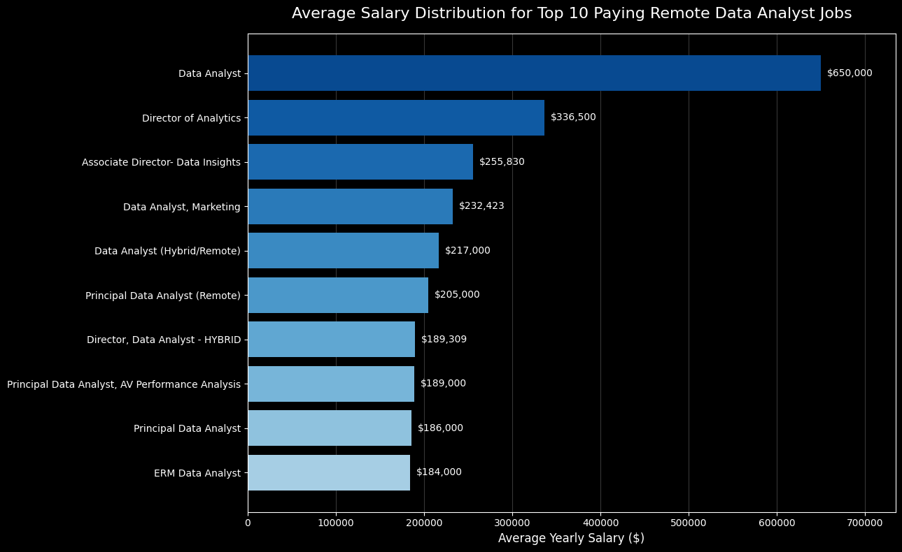
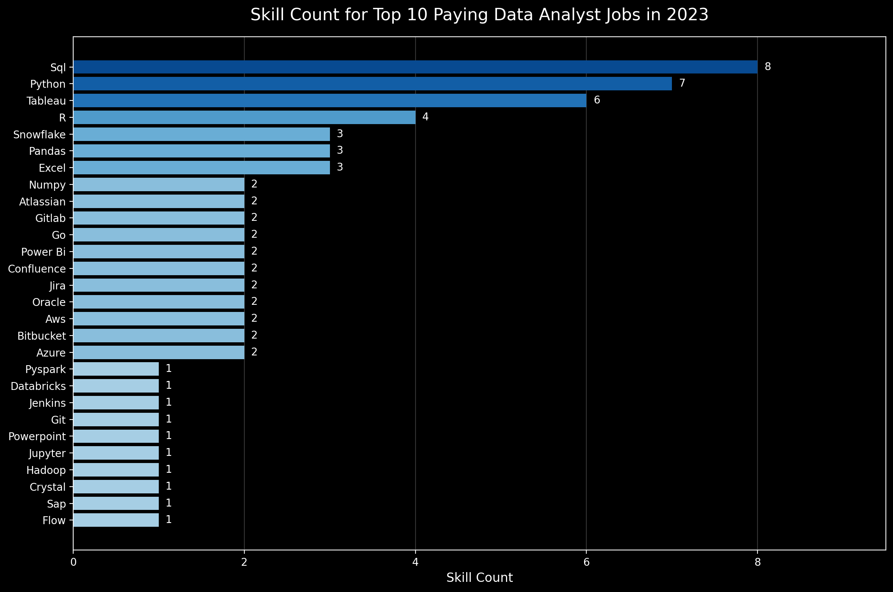

# Introduction
👋 Welcome to my SQL Portfolio Project, where I explore the data job market with a focus on data analyst roles. The goal of this project is to uncover the highest-paying opportunities 💰, identify the most in-demand skills 📈, and determine which skills offer the best combination of strong demand and high salaries 🎯.

Check out my SQL queries here: 📂 Check out my SQL queries here: 📂 [project_sql folder](/project_sql/)

<br>

# Backgroud
The motivation behind this project came from my desire to better understand the **data analyst job market** and make more informed decisions about my own career development. I wanted to identify which skills are **most in demand**, which are associated with **higher salaries**, and ultimately which skills are most valuable to learn to make my job search more focused and effective.

The dataset used in this analysis comes from **Luke Barousse’s SQL for Data Analytics course** (https://lukebarousse.com/sql) and includes information on job titles, salaries, locations, and required skills.

Through my SQL analysis, I set out to answer five key questions:

1. 💰 What are the **top-paying data analyst jobs**?

2. 🛠️ What **skills are required** for these top-paying roles?

3. 📈 What skills are **most in demand** for data analysts?

4. 💵 Which skills are associated with **higher salaries**?

5. 🎯 What are the **most optimal skills to learn**, considering both demand and salary?

<br>

# Tools I Used
In this project, I used a combination of tools to **query, manage, and analyze job market data**:

- **SQL (Structured Query Language):** Used to query the data, uncover insights, and answer the key questions guiding my analysis.

- **PostgreSQL:** Served as the database management system for storing, organizing, and querying the job posting data.

- **Visual Studio Code:** Used as my development environment to write, organize, and execute SQL queries throughout the project.

<br>

# The Analysis
Each query in this project was designed to explore a specific aspect of the **data analyst job market**. Here’s how I approached each of the five key questions:

### 1. Top Paying Data Analyst Jobs
To identify the highest-paying data analyst roles, I filtered positions based on average yearly salary, focusing specifically on remote opportunities. This query highlights the high paying opportunities in the field.

```sql
SELECT
 job_id,
 job_title,
 job_location,
 job_schedule_type,
 salary_year_avg,
 job_posted_date,
 name AS company_name
FROM
 job_postings_fact
LEFT JOIN company_dim ON job_postings_fact.company_id = company_dim.company_id
WHERE
 job_title_short = 'Data Analyst' AND 
 job_location = 'Anywhere' AND
 salary_year_avg IS NOT NULL
ORDER BY
 salary_year_avg DESC
LIMIT 10;
```
Here are some key insights from the top-paying Data Analyst roles in 2023:

- **Significant Salary Variation:** Salaries range from **$184K to $650K**, highlighting the substantial earning potential among top-paying Data Analyst positions.

- **Opportunities Across Industries:** High-paying roles are offered by companies such as **Meta, AT&T, and SmartAsset**, suggesting strong demand for data analytics expertise across different sectors.

- **Seniority Drives Higher Pay:** Several of the highest-paying positions are **Director, Associate Director, or Principal-level roles**, indicating that seniority and specialization are associated with higher salaries.


*Bar graph visualizing the salary for the top 10 salaries for data analysts; ChatGPT generated this graph from my SQL query results*

<br>

### 2. Skills for Top Paying Jobs
To understand what skills are required for the top-paying jobs, I joined the job postings with the skills data, providing insights into what employers value for high-compensation roles.

```sql
-- Gets the top 10 paying Data Analyst jobs
WITH top_paying_jobs AS (
SELECT
 job_id,
 job_title,
 salary_year_avg,
 name AS company_name
FROM
 job_postings_fact
LEFT JOIN company_dim ON job_postings_fact.company_id = company_dim.company_id
WHERE
 job_title_short = 'Data Analyst' AND 
 job_location = 'Anywhere' AND
 salary_year_avg IS NOT NULL
ORDER BY
 salary_year_avg DESC
LIMIT 10
)

SELECT
 top_paying_jobs.*,
 skills
FROM top_paying_jobs
INNER JOIN skills_job_dim ON top_paying_jobs.job_id = skills_job_dim.job_id
INNER JOIN skills_dim ON skills_job_dim.skill_id = skills_dim.skill_id
ORDER BY
 salary_year_avg DESC;
```

Here are the key insights into the most in-demand skills among the top 10 highest-paying Data Analyst jobs in 2023:

- **SQL Dominates:** SQL is the most sought-after skill, appearing in **8 out of 10** top-paying job postings.

- **Python & Tableau Stand Out:** Python appears in **7 roles**, closely followed by Tableau in **6**, highlighting the importance of both programming and data visualization skills.

- **Broader Technical Skill Set:** R, Snowflake, Pandas, and Excel also appear frequently, suggesting that high-paying Data Analyst roles value a combination of **programming, visualization, data processing, and cloud-based tools**.


*Bar chart showing the most frequently required skills among the top 10 highest-paying Data Analyst jobs in 2023; ChatGPT generated this graph from my SQL query results*

<br>

### 3. In-Demand Skills for Data Analysts
To identify the most in-demand skills for data analysts, I analyzed how frequently each skill appeared across job postings. This query highlights the skills that employers value most in the data analyst job market.

```sql
SELECT 
 skills,
 COUNT (skills_job_dim.job_id) AS demand_count
FROM job_postings_fact
INNER JOIN skills_job_dim ON job_postings_fact.job_id = skills_job_dim.job_id
INNER JOIN skills_dim ON skills_job_dim.skill_id = skills_dim.skill_id
WHERE
 job_title_short = 'Data Analyst' AND
 job_work_from_home = TRUE
GROUP BY
 skills
ORDER BY
 demand_count DESC
LIMIT 5;
```

Here's the breakdown of the most in-demand skills for Data Analysts in 2023:

- **SQL and Excel Lead the Market:** Both skills rank among the most in-demand, highlighting the continued importance of **data querying and spreadsheet analysis** in Data Analyst roles.

- **Programming and Visualization Skills Are Key:** **Python, Tableau, and Power BI** are also highly sought after, showing the value of combining **programming capabilities with data visualization and reporting skills**.

| Skills   | Demand Count |
|----------|-------------:|
| SQL      | 7,291        |
| Excel    | 4,611        |
| Python   | 4,330        |
| Tableau  | 3,745        |
| Power BI | 2,609        |

*Table showing the top 5 most in-demand skills for Data Analyst job postings in 2023.*

<br>

### 4. Skills Based on Salary
To identify the highest-paying skills for data analysts, I analyzed the average salary associated with each skill. This query highlights which skills are linked to higher earning potential in the field.

```sql
SELECT 
 skills,
 ROUND(AVG(salary_year_avg),0) AS avg_salary
FROM job_postings_fact
INNER JOIN skills_job_dim ON job_postings_fact.job_id = skills_job_dim.job_id
INNER JOIN skills_dim ON skills_job_dim.skill_id = skills_dim.skill_id
WHERE
 job_title_short = 'Data Analyst' AND
 salary_year_avg IS NOT NULL AND
 job_work_from_home = TRUE
GROUP BY
 skills
ORDER BY
 avg_salary DESC
LIMIT 25;
```

Here's the breakdown of the highest-paying skills for Data Analysts in 2023:

- **PySpark Stands Out:** PySpark has the highest average salary at approximately **$208K**, followed by Bitbucket at **$189K**, placing both well above the other skills in the ranking.

- **The Highest-Paying Skills Span Multiple Technical Areas:** The ranking includes technologies related to **big data, databases, machine learning, programming, development tools, and cloud infrastructure**, showing that high-paying Data Analyst roles can require a diverse technical skill set.

- **Higher-Paying Roles Extend Beyond Common Analytics Tools:** While commonly used Data Analyst skills such as **SQL, Excel, Python, Tableau, and Power BI** do not appear among the top 25 by average salary, technologies such as **PySpark, DataRobot, Jupyter, Pandas, Databricks, and Kubernetes** do. This suggests that the highest-paying roles in this dataset are associated with skills beyond the most commonly demanded analytics tools.

| Skill | Average Salary ($) |
|---|---:|
| PySpark | $208,172 |
| Bitbucket | $189,155 |
| Couchbase | $160,515 |
| Watson | $160,515 |
| DataRobot | $155,486 |
| GitLab | $154,500 |
| Swift | $153,750 |
| Jupyter | $152,777 |
| Pandas | $151,821 |
| Elasticsearch | $145,000 |
| Golang | $145,000 |
| NumPy | $143,513 |
| Databricks | $141,907 |
| Linux | $136,508 |
| Kubernetes | $132,500 |
| Atlassian | $131,162 |
| Twilio | $127,000 |
| Airflow | $126,103 |
| Scikit-learn | $125,781 |
| Jenkins | $125,436 |
| Notion | $125,000 |
| Scala | $124,903 |
| PostgreSQL | $123,879 |
| GCP | $122,500 |
| MicroStrategy | $121,619 |

*Table showing the top 25 highest-paying skills for remote Data Analyst roles in 2023.*

<br>

### 5. Most Optimal Skills to Learn
To identify the most valuable skills for Data Analysts, I combined demand and salary data to find skills that offer both strong job market demand and high earning potential. This query highlights the skills that may provide the best balance between career opportunities and salary.

```sql
WITH skills_demand AS (
SELECT
 skills_dim.skill_id,
 skills_dim.skills,
 COUNT (skills_job_dim.job_id) AS demand_count
FROM
 job_postings_fact
INNER JOIN skills_job_dim ON job_postings_fact.job_id = skills_job_dim.job_id
INNER JOIN skills_dim ON skills_job_dim.skill_id = skills_dim.skill_id
WHERE
 job_title_short = 'Data Analyst'
 AND salary_year_avg IS NOT NULL
 AND job_work_from_home = TRUE
GROUP BY
 skills_dim.skill_id
),

average_salary AS (
SELECT
 skills_dim.skill_id,
 skills_dim.skills,
 ROUND (AVG(salary_year_avg),0) AS avg_salary
FROM 
 job_postings_fact
INNER JOIN skills_job_dim ON job_postings_fact.job_id = skills_job_dim.job_id
INNER JOIN skills_dim ON skills_job_dim.skill_id = skills_dim.skill_id
WHERE
 job_title_short = 'Data Analyst' AND
 salary_year_avg IS NOT NULL AND
 job_work_from_home = TRUE
GROUP BY
 skills_dim.skill_id
)

SELECT 
 skills_demand.skill_id,
 skills_demand.skills,
 demand_count,
 avg_salary
FROM skills_demand
INNER JOIN average_salary ON skills_demand.skill_id = average_salary.skill_id
WHERE demand_count >10
ORDER BY
 demand_count DESC,
 avg_salary DESC
LIMIT 25;

-- rewriting this same query more concisely
SELECT
 skills_dim.skill_id,
 skills_dim.skills,
 COUNT (skills_job_dim.job_id) AS demand_count,
 ROUND (AVG (job_postings_fact.salary_year_avg),0) AS avg_salary
FROM
 job_postings_fact
INNER JOIN skills_job_dim ON job_postings_fact.job_id = skills_job_dim.job_id
INNER JOIN skills_dim ON skills_job_dim.skill_id = skills_dim.skill_id
WHERE
 job_title_short = 'Data Analyst'
 AND salary_year_avg IS NOT NULL
 AND job_work_from_home = TRUE
GROUP BY
skills_dim.skill_id
HAVING
 COUNT (skills_job_dim.job_id) >10
ORDER BY
 avg_salary DESC,
 demand_count DESC
LIMIT 25;
```

Here's the breakdown of the most optimal skills for Data Analysts in 2023:

- **SQL Offers the Strongest Demand:** SQL leads by a significant margin with **398 job postings** and an average salary of approximately **$97K**, making it a highly relevant skill in the Data Analyst job market.

- **Python Combines High Demand with a Higher Salary:** Python appears in **236 job postings** with an average salary of approximately **$101K**, offering one of the strongest combinations of demand and salary among the most widely requested skills.

- **Cloud and Big Data Skills Show Higher Salary Potential:** Skills such as **Snowflake, Azure, AWS, and Hadoop** have lower demand but average salaries above **$108K**, highlighting a trade-off between market demand and earning potential.

- **The Best Skill Strategy Balances Demand and Salary:** While some less common skills offer higher average salaries, widely requested skills such as **SQL, Python, Tableau, and R** provide a stronger balance between job opportunities and earning potential.

| Skill      | Demand Count | Average Salary ($) |
|------------|-------------:|-------------------:|
| SQL        | 398          | $97,237            |
| Excel      | 256          | $87,288            |
| Python     | 236          | $101,397           |
| Tableau    | 230          | $99,288            |
| R          | 148          | $100,499           |
| Power BI   | 110          | $97,431            |
| SAS        | 63           | $98,902            |
| PowerPoint | 58           | $88,701            |
| Looker     | 49           | $103,795           |
| Word       | 48           | $82,576            |
| Snowflake  | 37           | $112,948           |
| Oracle     | 37           | $104,534           |
| SQL Server | 35           | $97,786            |
| Azure      | 34           | $111,225           |
| AWS        | 32           | $108,317           |
| Sheets     | 32           | $86,088            |
| Flow       | 28           | $97,200            |
| Go         | 27           | $115,320           |
| SPSS       | 24           | $92,170            |
| VBA        | 24           | $88,783            |
| Hadoop     | 22           | $113,193           |
| Jira       | 20           | $104,918           |
| JavaScript | 20           | $97,587            |
| SharePoint | 18           | $81,634            |

*Table comparing skill demand and average salary for Data Analyst roles in 2023.*


Across these five queries, I explored the Data Analyst job market from different perspectives, uncovering patterns in salaries, skill demand, and the relationship between the two. The project also gave me practical experience turning raw data into meaningful and actionable insights.

<br>

# What I Learned

This project strengthened both my SQL proficiency and my ability to approach data with an analytical mindset:

- 🧩 **Query Construction:** Built structured queries using filters, multiple tables, **JOINs**, and **CTEs** to answer increasingly complex analytical questions.

- 📊 **Data Aggregation:** Applied **GROUP BY**, **COUNT()**, **AVG()**, and other SQL functions to summarize large datasets and identify meaningful patterns.

- 🔗 **Relational Data Analysis:** Connected job postings, companies, and skills across multiple tables to uncover relationships that were not visible in individual datasets.

- 🔍 **Analytical Problem-Solving:** Translated business questions into SQL queries, interpreted the results, and communicated the findings through clear insights and visualizations.

<br>

# Conclusions

### Insights
The analysis revealed several key takeaways about the Data Analyst job market in 2023:

1. 💰 **High-Paying Opportunities Vary Significantly:** The top 10 remote Data Analyst roles range from **$184K to $650K**, with several senior and leadership positions appearing among the highest-paying opportunities.

2. 🛠️ **SQL, Python, and Tableau Stand Out in Top-Paying Roles:** These were the most frequently requested skills among the highest-paying jobs, with **SQL appearing in 8 out of 10 roles**, Python in 7, and Tableau in 6.

3. 📈 **SQL Remains the Most In-Demand Skill:** Across remote Data Analyst job postings, **SQL leads demand by a considerable margin**, followed by Excel, Python, Tableau, and Power BI, reinforcing the importance of strong querying and analytical foundations.

4. 💵 **The Highest-Paying Skills Are Not Necessarily the Most In-Demand:** **PySpark** recorded the highest average salary at approximately **$208K**, followed by Bitbucket at **$189K**. However, these skills do not rank among the most frequently requested, showing that salary alone does not determine overall job market value.

5. 🎯 **Balancing Demand and Salary Reveals the Most Valuable Skills:** **SQL and Python emerge as particularly strong choices** when both factors are considered. SQL offers the greatest number of opportunities with an average salary of approximately **$97K**, while Python combines high demand with an average salary above **$101K**. Tableau and R also show a strong balance between demand and earning potential.

<br>

### Closing Thoughts
This project strengthened my SQL and analytical skills while giving me a deeper understanding of the Data Analyst job market. By exploring **skill demand, salaries, and job opportunities**, I gained valuable insights into the skills and technologies shaping the field.

More importantly, this project gave me hands-on experience using data to answer real-world questions, identify meaningful patterns, and communicate insights clearly. It also helped me better understand where to focus my **continued learning and professional development in data analytics**.